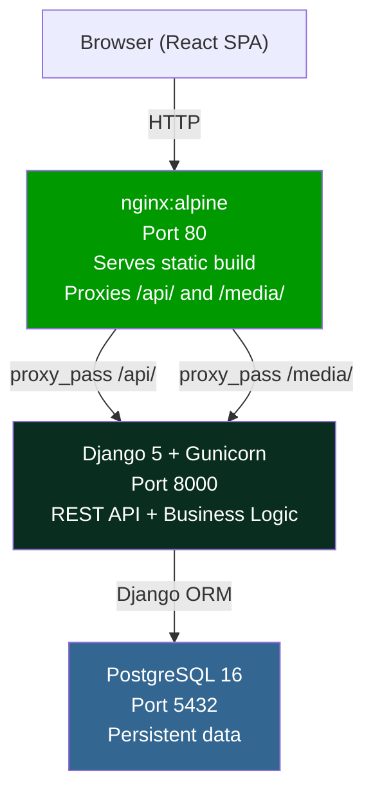
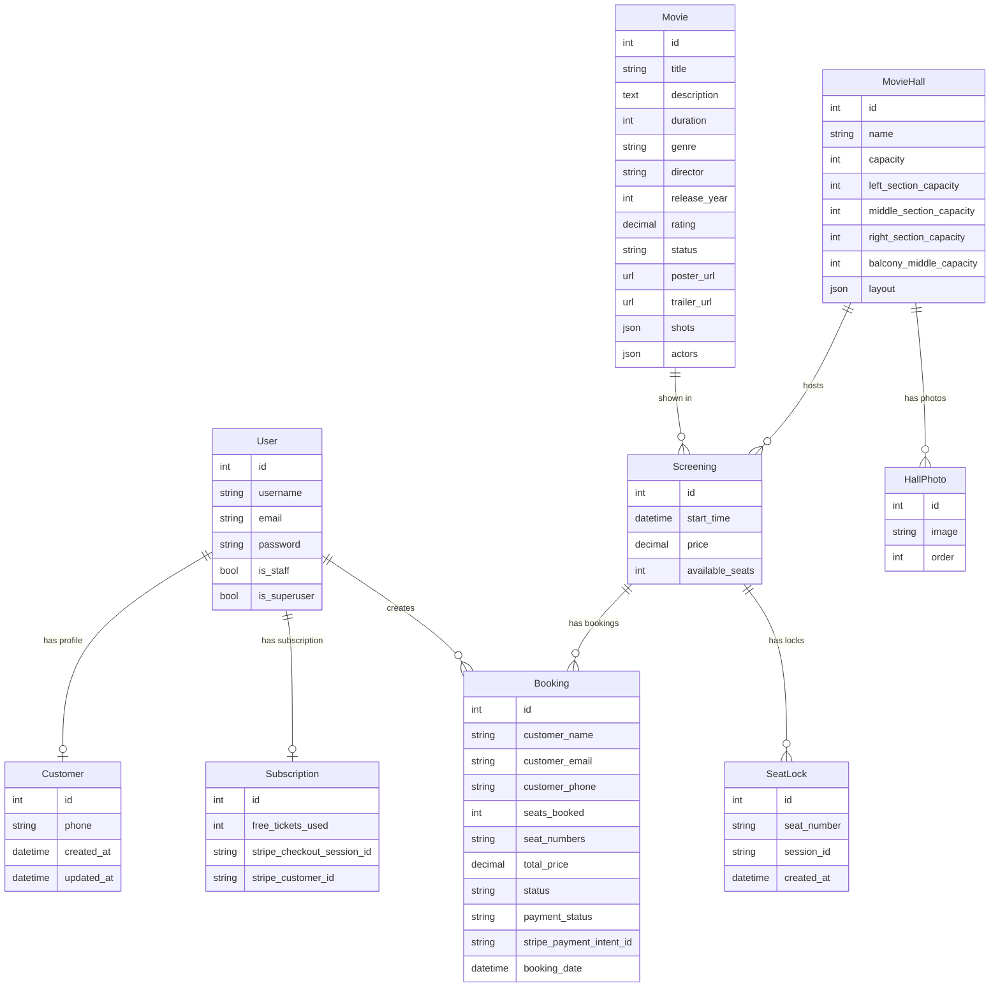
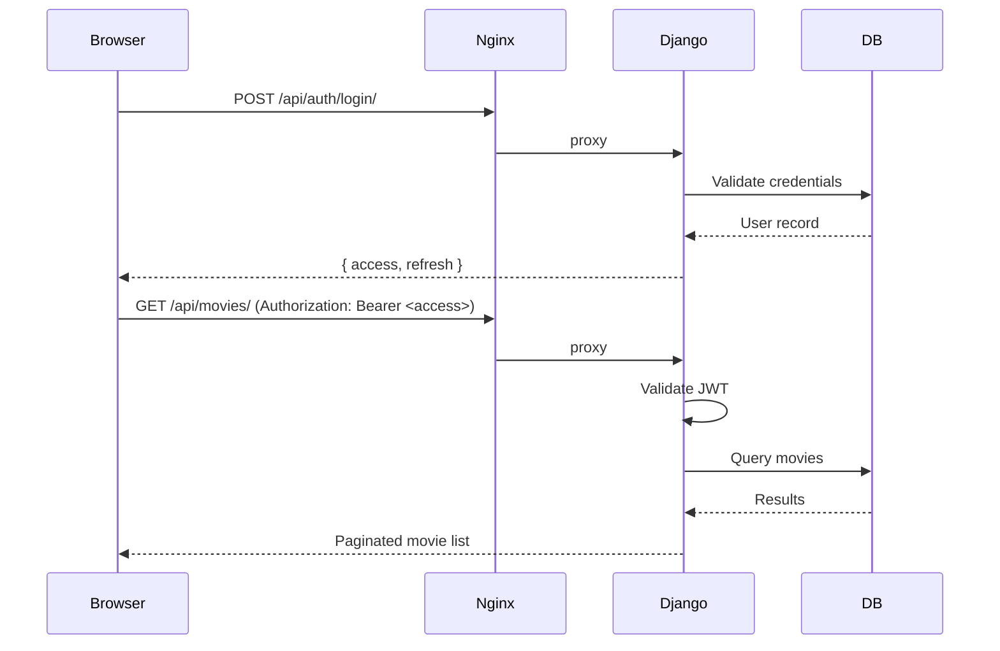

# Architecture

## Overview

AbsoluteCinema follows a **3-tier architecture** with each tier containerized independently.



| Tier | Technology | Responsibility |
|------|-----------|---------------|
| Presentation | React 19 + Vite + Tailwind | UI rendering, client-side routing, API calls |
| Business Logic | Django 5 + DRF + Gunicorn | REST API, authentication, booking logic, Stripe integration |
| Data | PostgreSQL 16 | Persistent storage, relational integrity |

---

## Data Models (Entity-Relationship)



---

## Backend Structure

```
BackEnd/
├── cinema_backend/         Django project config
│   ├── settings.py         All settings (reads from env vars)
│   ├── urls.py             Root URL routing
│   ├── wsgi.py             WSGI entry point (Gunicorn)
│   └── settings_test.py    Test settings (SQLite in-memory)
└── cinema/                 Main application
    ├── models/             ORM models (Movie, Screening, Booking, etc.)
    ├── views/              ViewSets and API views
    ├── serializers/        DRF serializers
    ├── services/           Business logic layer
    ├── repositories.py     Data access layer
    ├── container.py        Dependency injection (dependency-injector)
    ├── permissions.py      Custom DRF permissions (RBAC)
    ├── auth_views.py       Authentication endpoints
    ├── tmdb_service.py     TMDB API integration
    └── management/
        └── commands/
            ├── bootstrap_accounts.py   Create admin/staff users
            ├── seed_db.py              Seed halls, photos, movies
            └── refresh_movies_from_tmdb.py
```

The backend uses the **Repository + Service + Controller** pattern with Dependency Injection to separate concerns:

- **Controllers** (views/) — handle HTTP, validate input, call services
- **Services** (services/) — business rules, orchestration
- **Repositories** (repositories.py) — database queries via Django ORM

---

## Frontend Structure

```
FrontEnd/src/
├── api/            Backend API client functions (one file per resource)
│   ├── auth.js     Authentication calls
│   ├── movies.js   Movie listing and detail
│   ├── bookings.js Booking creation and retrieval
│   ├── halls.js    Hall data
│   ├── screenings.js
│   ├── payments.js Stripe integration
│   └── subscription.js
├── components/     Reusable UI components (Radix UI based)
├── context/        React context (AuthContext, etc.)
├── hooks/          Custom React hooks
├── pages/          Route-level page components
├── utils/          Utility functions
└── lib/            Third-party wrappers (GSAP, etc.)
```

All API calls use `import.meta.env.VITE_API_URL` as the base URL (empty in Docker = same origin, proxied by nginx).

---

## Authentication Flow


