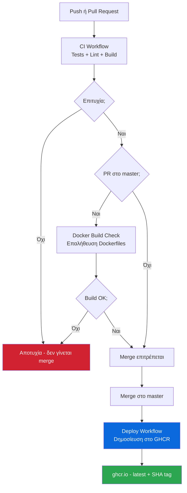

# CI/CD - Συνεχής Ενσωμάτωση & Ανάπτυξη

## Επισκόπηση

Το αποθετήριο χρησιμοποιεί **GitHub Actions** για αυτόματο έλεγχο ποιότητας και δημοσίευση εικόνων Docker. Κάθε αλλαγή ελέγχεται πριν φτάσει στο `master`.



---

## Workflows

### 1. CI (`ci.yml`)

**Πότε τρέχει:** Σε κάθε `push` και `pull_request` σε οποιοδήποτε branch.

**Jobs:**

| Job | Βήματα | Σκοπός |
|-----|--------|--------|
| `backend-test` | Python 3.12 → `pip install` → `pytest` | Εκτελεί όλα τα unit + integration tests με SQLite |
| `frontend-check` | Node 22 → `npm ci` → `npm run lint` → `npm run build` | Έλεγχος syntax, κανόνων, και επιτυχούς build |

Το backend χρησιμοποιεί `settings_test.py` (SQLite) — δεν απαιτείται PostgreSQL στο CI.

Το coverage report αποθηκεύεται ως artifact για 7 ημέρες.

---

### 2. Docker Build Check (`docker-build.yml`)

**Πότε τρέχει:** Σε `pull_request` που στοχεύει το `master` ή `main`.

**Jobs:**
- Builds την εικόνα backend (χωρίς push)
- Builds την εικόνα frontend (χωρίς push)

Ο σκοπός είναι να εντοπιστούν προβλήματα στα `Dockerfile` πριν το merge. Χρησιμοποιεί GitHub Actions cache για γρήγορα builds.

---

### 3. Deploy (`deploy.yml`)

**Πότε τρέχει:** Σε `push` στο `master` (δηλαδή κάθε φορά που γίνεται merge).

**Jobs:**
1. Σύνδεση στο **GitHub Container Registry** (`ghcr.io`) με `GITHUB_TOKEN` — δεν απαιτούνται επιπλέον secrets
2. Build και push εικόνας backend:
   - `ghcr.io/jimpar1/absolute-cinemas-backend:latest`
   - `ghcr.io/jimpar1/absolute-cinemas-backend:<sha>` (πρώτα 7 χαρακτήρες του commit SHA)
3. Build και push εικόνας frontend (ίδιες ετικέτες)
4. Summary στο GitHub Actions UI με τις εικόνες που δημοσιεύτηκαν

**Χρήση εικόνων:**

```yaml
# docker-compose.yml σε production server
services:
  backend:
    image: ghcr.io/jimpar1/absolute-cinemas-backend:latest
  frontend:
    image: ghcr.io/jimpar1/absolute-cinemas-frontend:latest
```

**Σύνδεση με Railway/Render:**

Και τα δύο πλατφόρμες υποστηρίζουν auto-deploy από GitHub push:
- **Railway**: Σύνδεσε το αποθετήριο και επίλεξε το branch `master`. Εντοπίζει αυτόματα το `docker-compose.yml`.
- **Render**: Δημιούργησε Web Service → GitHub → επίλεξε branch `master` → Docker.

---

### 4. Security Scan (`security.yml`)

**Πότε τρέχει:** Κάθε Δευτέρα στις 09:00 UTC, ή χειροκίνητα από το GitHub UI (`workflow_dispatch`).

**Jobs:**

| Job | Εργαλείο | Ελέγχει |
|-----|---------|---------|
| `backend-audit` | `pip-audit` | Python packages σε `requirements.txt` |
| `frontend-audit` | `npm audit` | Node packages σε `package.json` |
| `open-issue` | GitHub API | Δημιουργεί issue αν βρεθούν vulnerabilities |

Αν εντοπιστούν ευπάθειες (severity >= moderate), ανοίγει αυτόματα ένα GitHub Issue με την ετικέτα `security` που περιέχει το πλήρες report.

---

### 5. CodeQL Analysis (`codeql.yml`)

**Πότε τρέχει:** Push/PR στο `master`/`main`, και εβδομαδιαία (Δευτέρα 08:00 UTC).

**Αναλύει:**
- **Python** — Django backend, security + quality queries
- **JavaScript** — React frontend, security + quality queries

Τα αποτελέσματα εμφανίζονται στο tab **Security → Code scanning** του αποθετηρίου.

---

## Badges

Πρόσθεσε τα παρακάτω badges στο `README.md` για άμεση εικόνα κατάστασης:

```markdown
[](https://github.com/jimpar1/AbsoluteCinemasV2/actions/workflows/ci.yml)
[](https://github.com/jimpar1/AbsoluteCinemasV2/actions/workflows/docker-build.yml)
[](https://github.com/jimpar1/AbsoluteCinemasV2/actions/workflows/codeql.yml)
```

---

## Απαιτήσεις & Secrets

Κανένα επιπλέον secret δεν απαιτείται για τα βασικά workflows. Το `GITHUB_TOKEN` παρέχεται αυτόματα από το GitHub.

Για production deployment σε VPS (αντί Railway/Render), μπορείς να προσθέσεις:

| Secret | Περιγραφή |
|--------|-----------|
| `DEPLOY_HOST` | IP ή hostname του server |
| `DEPLOY_KEY` | SSH private key για σύνδεση |
| `DEPLOY_USER` | SSH username |

Και να επεκτείνεις το `deploy.yml` με ένα `ssh-action` step που κάνει `docker compose pull && docker compose up -d`.
