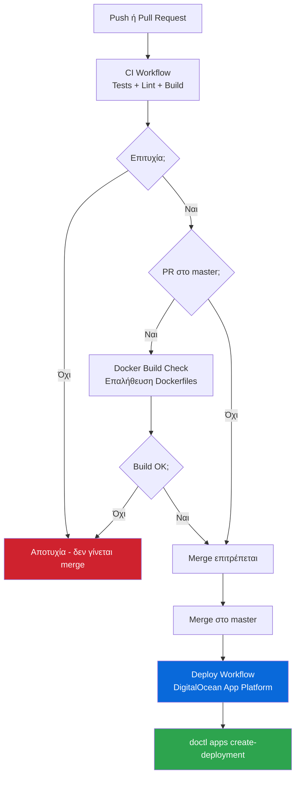

# CI/CD - Συνεχής Ενσωμάτωση & Ανάπτυξη

## Επισκόπηση

Το αποθετήριο χρησιμοποιεί **GitHub Actions** για αυτόματο έλεγχο ποιότητας και δημοσίευση εικόνων Docker. Κάθε αλλαγή ελέγχεται πριν φτάσει στο `master`.



---

## Workflows

### 1. CI (`ci.yml`)

**Πότε τρέχει:** Σε κάθε `push` και `pull_request` σε οποιοδήποτε branch.

**Jobs:**

| Job | Βήματα | Σκοπός |
|-----|--------|--------|
| `backend-test` | Python 3.12 → `pip install` → `pytest` | Εκτελεί όλα τα unit + integration tests με SQLite |
| `frontend-check` | Node 22 → `npm ci` → `npm run lint` → `npm run build` | Έλεγχος syntax, κανόνων, και επιτυχούς build |

Το backend χρησιμοποιεί `settings_test.py` (SQLite) — δεν απαιτείται PostgreSQL στο CI.

Το coverage report αποθηκεύεται ως artifact για 7 ημέρες.

---

### 2. Docker Build & Push (`docker-build.yml`)

**Πότε τρέχει:** Σε κάθε `push` στο `master`/`main` και σε `pull_request` που στοχεύει αυτά τα branches.

**Jobs:**
- Builds και pushes την εικόνα backend στο **GitHub Container Registry** (GHCR)
- Builds και pushes την εικόνα frontend στο GHCR

Σε PRs γίνεται μόνο build (χωρίς push). Σε push στο master/main δημοσιεύονται οι εικόνες:
- `ghcr.io/jimpar1/absolutecinemas-backend:latest`
- `ghcr.io/jimpar1/absolutecinemas-backend:<sha>` (πρώτα 7 χαρακτήρες του SHA)
- Αντίστοιχα για το frontend

Χρησιμοποιεί `GITHUB_TOKEN` — δεν απαιτούνται επιπλέον secrets.

---

### 3. Deploy (`deploy.yml`)

**Πότε τρέχει:** Όταν ολοκληρωθεί επιτυχώς το Release workflow στο `master`.

**Jobs:**
1. Σύνδεση στο **DigitalOcean** με `DIGITALOCEAN_ACCESS_TOKEN`
2. Εκκίνηση νέου deployment στο App Platform:
   ```bash
   doctl apps create-deployment $DO_APP_ID --wait
   ```

**Απαιτούμενα secrets:**

| Secret | Περιγραφή |
|--------|-----------|
| `DIGITALOCEAN_ACCESS_TOKEN` | API token για doctl |
| `DO_APP_ID` | ID της εφαρμογής στο DigitalOcean App Platform |

---

### 4. Security Scan (`security.yml`)

**Πότε τρέχει:** Κάθε Δευτέρα στις 09:00 UTC, ή χειροκίνητα από το GitHub UI (`workflow_dispatch`).

**Jobs:**

| Job | Εργαλείο | Ελέγχει |
|-----|---------|---------|
| `backend-audit` | `pip-audit` | Python packages σε `requirements.txt` |
| `frontend-audit` | `npm audit` | Node packages σε `package.json` |
| `open-issue` | GitHub API | Δημιουργεί issue αν βρεθούν vulnerabilities |

Αν εντοπιστούν ευπάθειες (severity >= moderate), ανοίγει αυτόματα ένα GitHub Issue με την ετικέτα `security` που περιέχει το πλήρες report.

---

### 5. CodeQL Analysis (`codeql.yml`)

**Πότε τρέχει:** Push/PR στο `master`/`main`, και εβδομαδιαία (Δευτέρα 08:00 UTC).

**Αναλύει:**
- **Python** — Django backend, security + quality queries
- **JavaScript** — React frontend, security + quality queries

Τα αποτελέσματα εμφανίζονται στο tab **Security → Code scanning** του αποθετηρίου.

---

## Badges

Πρόσθεσε τα παρακάτω badges στο `README.md` για άμεση εικόνα κατάστασης:

```markdown
[](https://github.com/jimpar1/Absolute-Cinemas/actions/workflows/ci.yml)
[](https://github.com/jimpar1/Absolute-Cinemas/actions/workflows/docker-build.yml)
[](https://github.com/jimpar1/Absolute-Cinemas/actions/workflows/codeql.yml)
```

---

## Απαιτήσεις & Secrets

Κανένα επιπλέον secret δεν απαιτείται για τα βασικά workflows (CI, Docker Build, Security, CodeQL). Το `GITHUB_TOKEN` παρέχεται αυτόματα από το GitHub.

Για το `deploy.yml` (DigitalOcean App Platform) απαιτούνται:

| Secret | Περιγραφή |
|--------|-----------|
| `DIGITALOCEAN_ACCESS_TOKEN` | API token για doctl |
| `DO_APP_ID` | ID της εφαρμογής στο App Platform |
