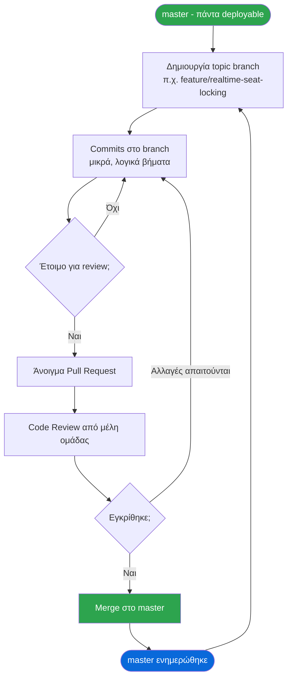
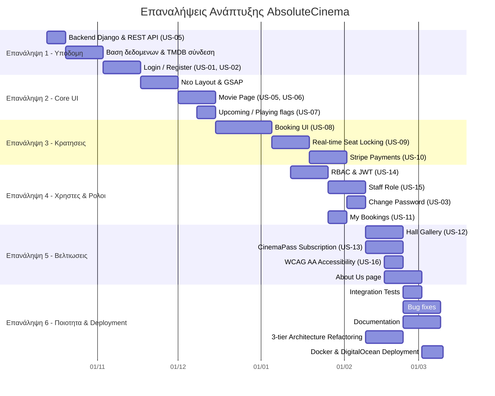
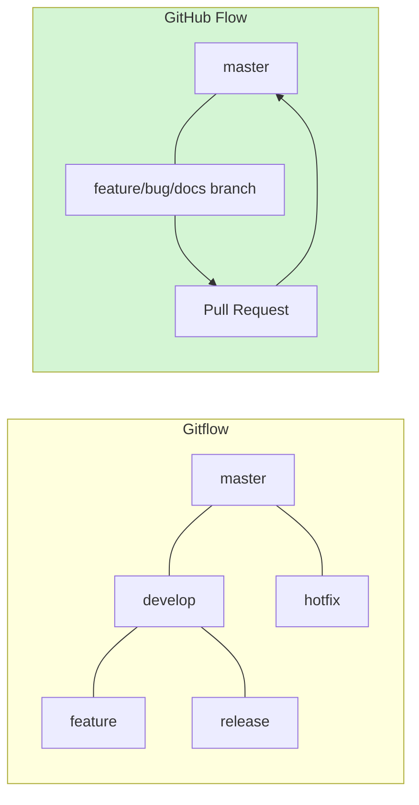

# Μεθοδολογία Ανάπτυξης  GitHub Flow

> **AbsoluteCinema** | Ομάδα Ανάπτυξης: jimpar1 · Ma1cOS · nkourso · GTzimos

---

##  Βιβλιογραφικές Αναφορές

Η μεθοδολογία που ακολούθησε η ομάδα βασίζεται στο **GitHub Flow**, όπως τεκμηριώνεται στις ακόλουθες πηγές:

| # | Αναφορά |
|---|---------|
| [1] | Chacon, S. (2011). *GitHub Flow*. Blog post. Ανακτήθηκε από: http://scottchacon.com/2011/08/31/github-flow.html |
| [2] | Chacon, S., & Straub, B. (2014). *Pro Git* (2η έκδ.). Apress. Κεφάλαιο 5: «Distributed Git». Διαθέσιμο: https://git-scm.com/book/en/v2 |
| [3] | GitHub, Inc. (2024). *GitHub flow*. GitHub Docs. Ανακτήθηκε από: https://docs.github.com/en/get-started/using-github/github-flow |
| [4] | Driessen, V. (2010). *A successful Git branching model* (Gitflow). Αναφέρεται ως σύγκριση. https://nvie.com/posts/a-successful-git-branching-model/ |
| [5] | Humble, J., & Farley, D. (2010). *Continuous Delivery*. Addison-Wesley. (Θεωρητικό υπόβαθρο για CI/CD που ευθυγραμμίζεται με GitHub Flow.) |

---

##  Τι είναι το GitHub Flow

Το **GitHub Flow** είναι ένα ελαφρύ, branch-based workflow σχεδιασμένο για ομάδες που κάνουν συχνές παραδόσεις (Chacon, 2011). Σε αντίθεση με το πιο σύνθετο Gitflow (Driessen, 2010), δεν χρησιμοποιεί ξεχωριστά `develop`, `release` ή `hotfix` branches  όλη η εργασία γίνεται σε topic branches που συγχωνεύονται απευθείας στο `master`.

### Οι 6 Κανόνες του GitHub Flow

> Βασισμένοι στον Chacon (2011) και τεκμηριωμένοι στο GitHub Docs (2024):

1. **Ό,τι βρίσκεται στο `master` είναι πάντα deployable**  το κύριο branch δεν σπάει ποτέ.
2. **Κάθε νέο feature/fix ξεκινά σε ξεχωριστό branch**  με περιγραφικό όνομα (`feature/real-time-seat-locking`).
3. **Commit τακτικά στο topic branch**  κάθε commit αντικατοπτρίζει μια λογική αλλαγή.
4. **Άνοιγμα Pull Request όταν η εργασία είναι έτοιμη για έλεγχο**  PR = σημείο συζήτησης και code review.
5. **Συγχώνευση στο `master` μόνο μετά από review**  ποτέ χωρίς έγκριση.
6. **Deploy αμέσως μετά τη συγχώνευση**  ή τουλάχιστον τακτικά από το `master`.

---

##  Διάγραμμα Workflow

---

##  User Stories

Οι user stories παρακάτω προέκυψαν από τις λειτουργίες που αναπτύχθηκαν, όπως τεκμηριώνονται στα branches και commits της ομάδας. Ακολουθεί το πρότυπο:

> **Ως** [ρόλος], **θέλω** [λειτουργία], **ώστε** [αξία].

---

###  Αυθεντικοποίηση & Διαχείριση Χρηστών

| ID | User Story | Branch | Κατάσταση |
|----|-----------|--------|-----------|
| US-01 | Ως **επισκέπτης**, θέλω να δημιουργήσω λογαριασμό με email και κωδικό, ώστε να μπορώ να κάνω κρατήσεις. | `feature/login-register` |  Ολοκληρώθηκε |
| US-02 | Ως **εγγεγραμμένος χρήστης**, θέλω να συνδεθώ με username και κωδικό, ώστε να έχω πρόσβαση στον λογαριασμό μου. | `feature/mysql-login-logout` |  Ολοκληρώθηκε |
| US-03 | Ως **χρήστης**, θέλω να αλλάξω τον κωδικό μου, ώστε να διατηρώ τον λογαριασμό μου ασφαλή. | `feature/change-password` |  Ολοκληρώθηκε |
| US-04 | Ως **χρήστης**, θέλω να επεξεργαστώ τα στοιχεία του προφίλ μου, ώστε τα δεδομένα μου να είναι ενημερωμένα. | `fix/profile-edit` |  Ολοκληρώθηκε |

---

###  Ταινίες & Προβολές

| ID | User Story | Branch | Κατάσταση |
|----|-----------|--------|-----------|
| US-05 | Ως **επισκέπτης**, θέλω να αναζητήσω και να φιλτράρω ταινίες ανά είδος, ώστε να βρω αυτό που με ενδιαφέρει. | `feature/movie-page-update` |  Ολοκληρώθηκε |
| US-06 | Ως **επισκέπτης**, θέλω να δω λεπτομέρειες ταινίας (trailer, ηθοποιοί, προβολές), ώστε να αποφασίσω αν θέλω εισιτήριο. | `feature/movie-page-update` |  Ολοκληρώθηκε |
| US-07 | Ως **επισκέπτης**, θέλω να δω ποιες ταινίες προβάλλονται τώρα και ποιες έρχονται, ώστε να σχεδιάσω την επίσκεψή μου. | `feature/upcoming-playing-flags` |  Ολοκληρώθηκε |

---

###  Κράτηση Εισιτηρίων

| ID | User Story | Branch | Κατάσταση |
|----|-----------|--------|-----------|
| US-08 | Ως **χρήστης**, θέλω να επιλέξω θέση από διαδραστικό χάρτη αίθουσας, ώστε να κάνω κράτηση στο επιθυμητό κάθισμα. | `feature/realtime-booking-ui` |  Ολοκληρώθηκε |
| US-09 | Ως **χρήστης**, θέλω οι κατειλημμένες θέσεις να ενημερώνονται σε πραγματικό χρόνο, ώστε να αποφύγω διπλοκρατήσεις. | `feature/realtime-seat-locking` |  Ολοκληρώθηκε |
| US-10 | Ως **χρήστης**, θέλω να ολοκληρώσω την πληρωμή μέσω Stripe, ώστε η κράτησή μου να επιβεβαιωθεί αμέσως. | `feature/stripe-integration` |  Ολοκληρώθηκε |
| US-11 | Ως **χρήστης**, θέλω να δω το ιστορικό κρατήσεών μου, ώστε να παρακολουθώ τις αγορές μου. | `feature/rbac-jwt` |  Ολοκληρώθηκε |

---

### ️ Αίθουσες & Υποδομή

| ID | User Story | Branch | Κατάσταση |
|----|-----------|--------|-----------|
| US-12 | Ως **επισκέπτης**, θέλω να δω φωτογραφίες των αιθουσών, ώστε να γνωρίζω το περιβάλλον πριν την επίσκεψη. | `feature/hall-gallery-photos` |  Ολοκληρώθηκε |
| US-13 | Ως **χρήστης**, θέλω να αγοράσω συνδρομή CinemaPass, ώστε να απολαμβάνω μειωμένες τιμές σε εισιτήρια. | `feature/subscription-integration` |  Ολοκληρώθηκε |

---

###  Ασφάλεια & Διαχείριση

| ID | User Story | Branch | Κατάσταση |
|----|-----------|--------|-----------|
| US-14 | Ως **διαχειριστής**, θέλω να ελέγχω τα δικαιώματα πρόσβασης με βάση ρόλους (RBAC), ώστε μόνο εξουσιοδοτημένοι χρήστες να τροποποιούν δεδομένα. | `feature/rbac-jwt`, `feature/rbac-enhancement` |  Ολοκληρώθηκε |
| US-15 | Ως **μέλος staff**, θέλω να έχω περιορισμένη πρόσβαση διαχείρισης (χωρίς πλήρη admin δικαιώματα), ώστε να εκτελώ τις εργασίες μου με ασφάλεια. | `feature/staff-role` |  Ολοκληρώθηκε |
| US-16 | Ως **χρήστης με αναπηρία**, θέλω η εφαρμογή να πληροί τα πρότυπα WCAG AA, ώστε να μπορώ να τη χρησιμοποιώ χωρίς εμπόδια. | `feature/wcag-aa` |  Ολοκληρώθηκε |
| US-17 | Ως **developer**, θέλω να εκκινώ ολόκληρο το project με μία εντολή (`docker compose up`), ώστε να αποφεύγω χειροκίνητη εγκατάσταση εξαρτήσεων. | `feature/docker-setup` |  Ολοκληρώθηκε |

---

##  Επαναλήψεις (Iterations)

Το GitHub Flow δεν επιβάλλει τυπικά sprints, αλλά η ομάδα οργάνωσε την εργασία σε λογικές **επαναλήψεις παράδοσης** βασισμένες στη σειρά συγχώνευσης των branches:

---

##  GitHub Flow vs Gitflow  Γιατί επιλέξαμε GitHub Flow

| Κριτήριο | Gitflow | GitHub Flow |
|----------|---------|-------------|
| Πολυπλοκότητα | Υψηλή | Χαμηλή  |
| Κατάλληλο για μικρές ομάδες | Μέτρια | Πολύ καλά  |
| Συχνές παραδόσεις | Δύσκολο | Φυσικό  |
| Μαθησιακή καμπύλη | Απότομη | Ήπια  |
| Υποστήριξη από GitHub | Μερική | Πλήρης  |

Η ομάδα επέλεξε το GitHub Flow διότι αντιστοιχεί στον τρόπο λειτουργίας μικρών ομάδων 4 ατόμων που εργάζονται παράλληλα σε ανεξάρτητα features, χωρίς την πολυπλοκότητα της διαχείρισης πολλαπλών μακρόβιων branches.

---

##  Ορισμός Ολοκλήρωσης (Definition of Done)

Σύμφωνα με τις αρχές του GitHub Flow, κάθε User Story θεωρείται **ολοκληρωμένη** όταν:

- [ ] Ο κώδικας έχει γραφτεί και ανέβει στο topic branch
- [ ] Τα tests περνούν (unit + integration όπου εφαρμόζεται)
- [ ] Έχει ανοιχτεί Pull Request με περιγραφή
- [ ] Τουλάχιστον ένα άλλο μέλος έχει κάνει review
- [ ] Έχει γίνει merge στο `master`
- [ ] Το `master` παραμένει σε deployable κατάσταση

---

##  Σύνοψη

Το **GitHub Flow** αποδείχθηκε ιδανική μεθοδολογία για το AbsoluteCinema. Επέτρεψε στα μέλη της ομάδας να εργάζονται παράλληλα σε ανεξάρτητα feature branches, να παραδίδουν λειτουργικές εκδόσεις σταδιακά μέσω Pull Requests, χωρίς να διακόπτεται η σταθερότητα του `master`. Η απλότητα του workflow — branch → commit → PR → merge — ταίριαξε απόλυτα με τον ρυθμό και το μέγεθος της ομάδας μας.
